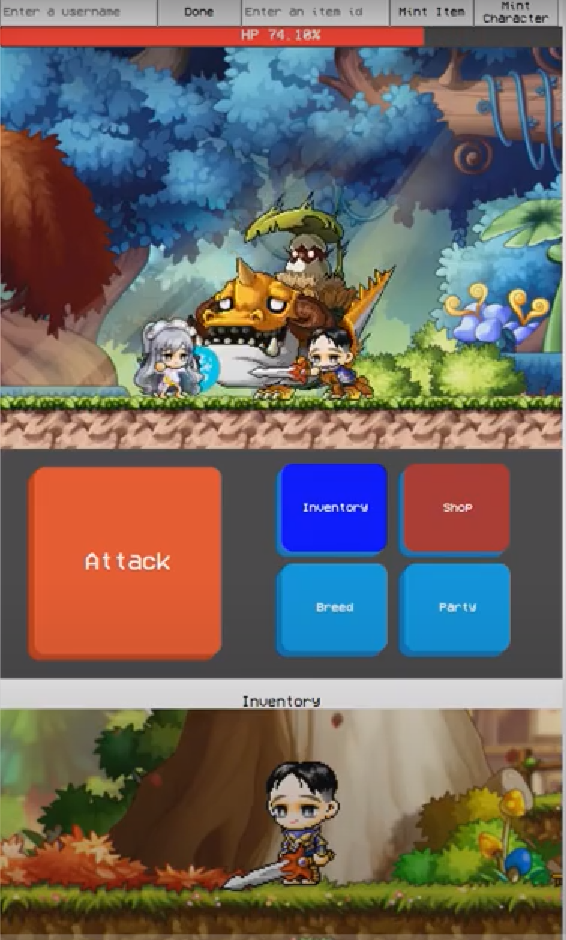
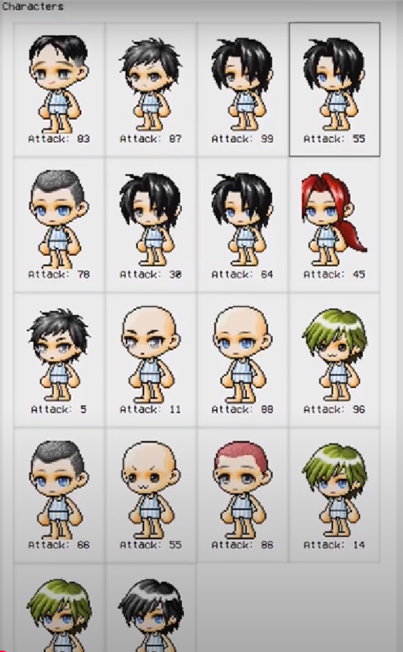
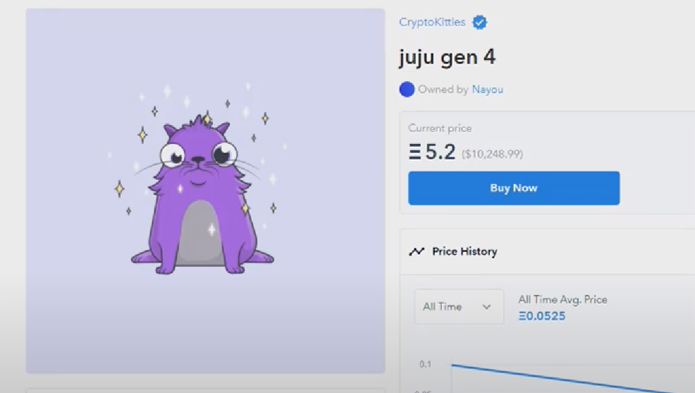
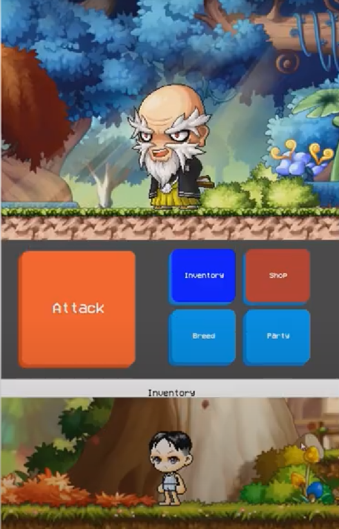
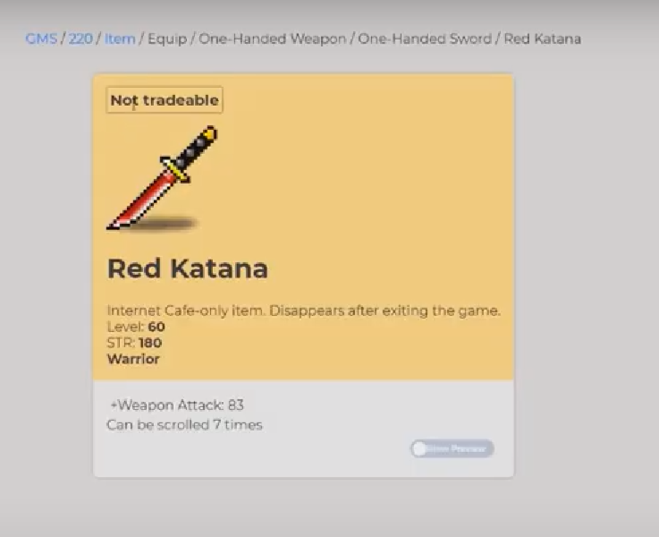
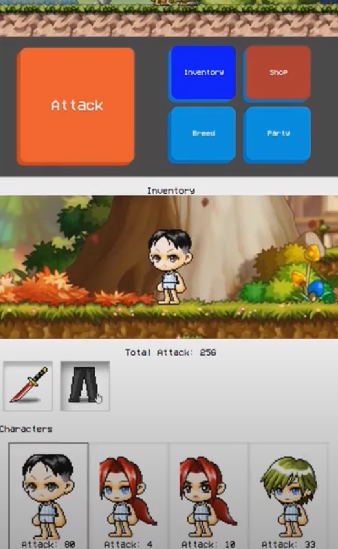

# 🚀 NFTClash

**NFTClash** is a Web3-powered dApp game where users can collect, trade, and battle with NFTs on the blockchain. Built with ❤️ using React, Solidity, and Web3.js.

---

## 🎮 Features

- 🔐 Connect with MetaMask
- 🧠 Smart Contracts (Solidity)
- 🖼 Mint, Buy & Sell NFTs
- ⚔️ NFT Battle Arena (coming soon)
- 🌐 Deployed on [Testnet / Mainnet]

---

## ⚙️ Tech Stack

- **Frontend**: React.js, Web3.js
- **Smart Contracts**: Solidity
- **Blockchain**: Ethereum / Polygon / Any EVM chain
- **Tools**: Hardhat / Truffle, IPFS, MetaMask, Ethers.js

---

## 📁 Folder Structure

